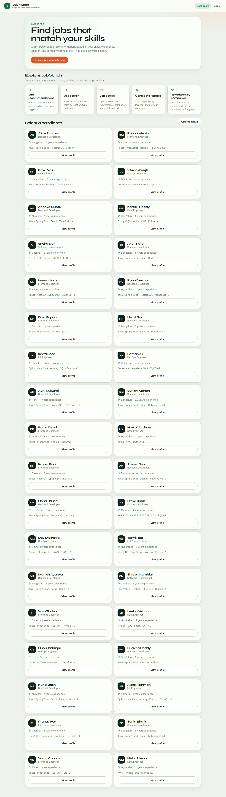
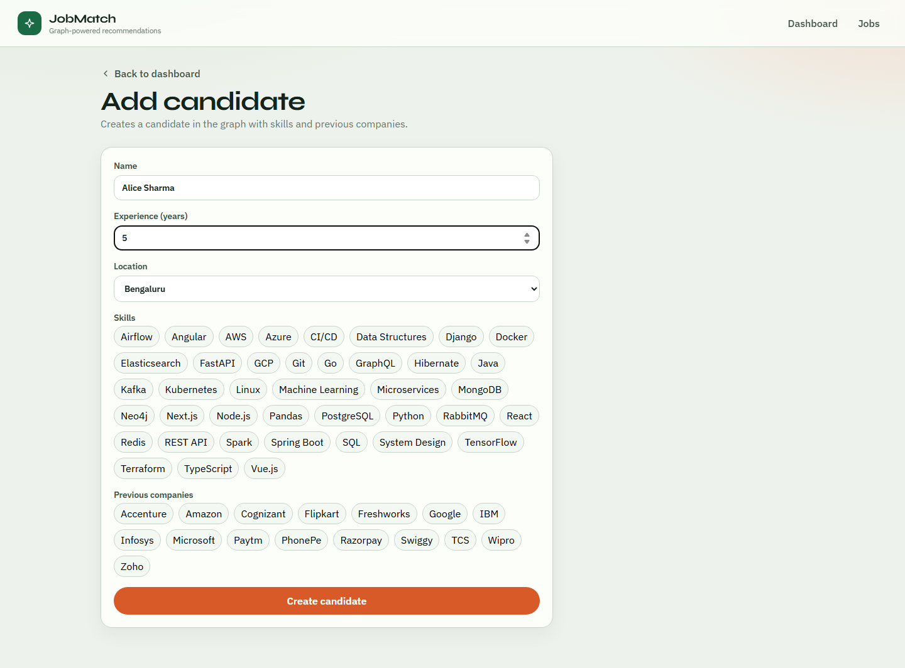
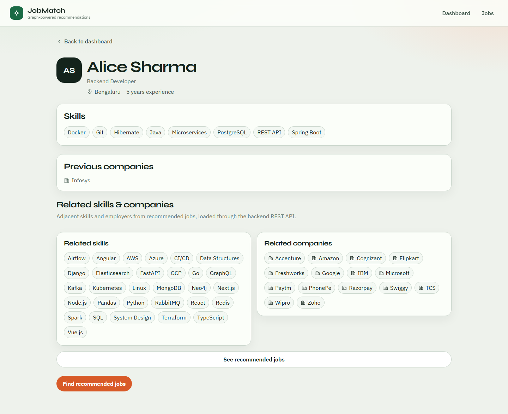

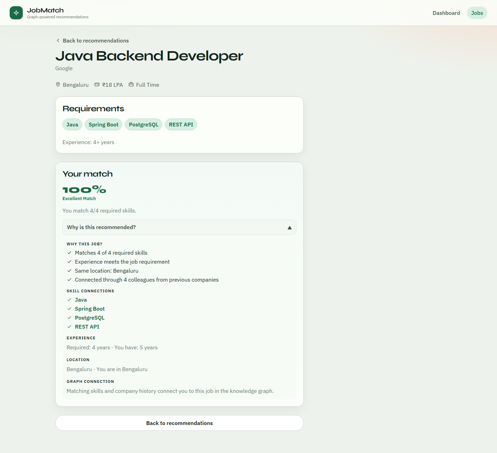

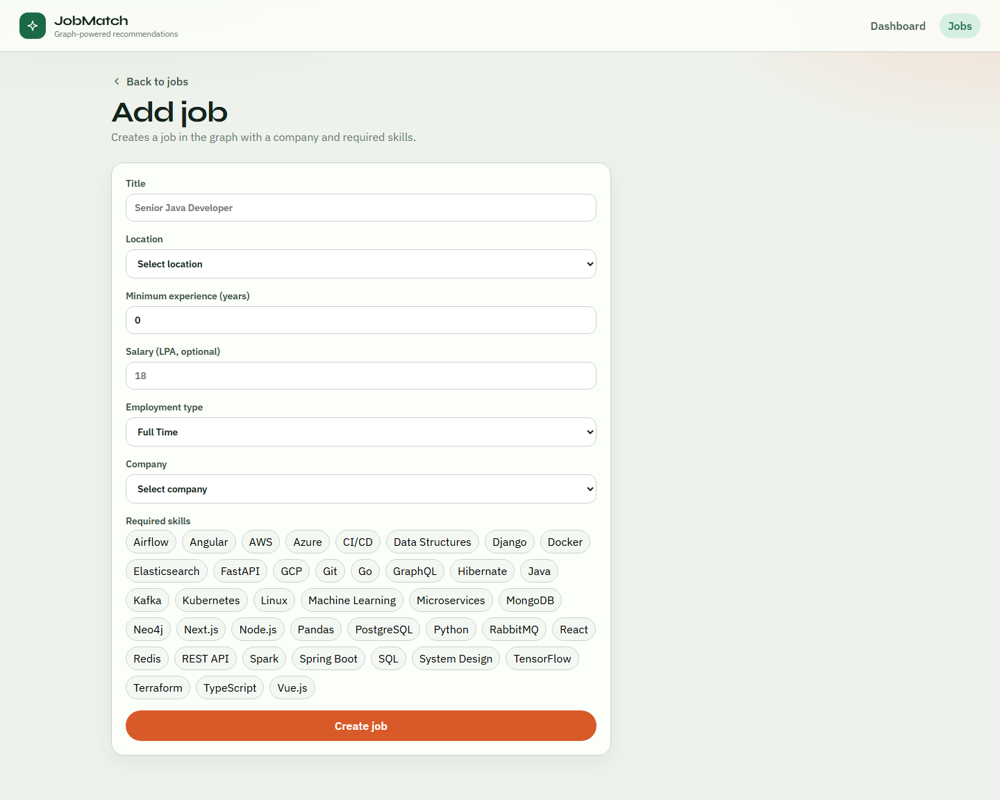
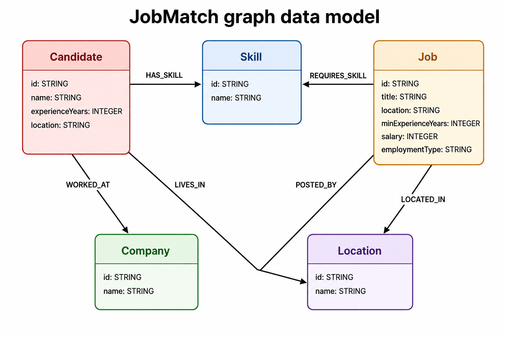
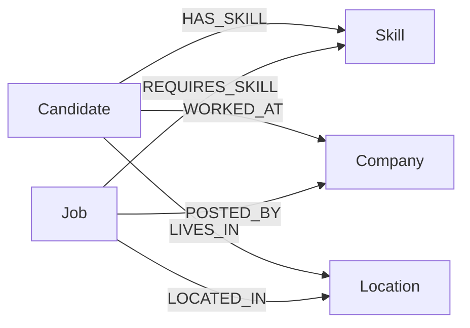
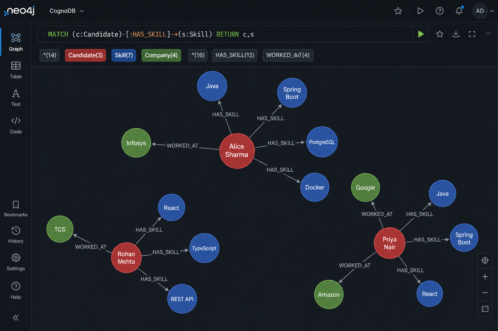

# Job Recommendation

Graph-powered job matching: a Spring Boot API on CognoDB plus a React UI.

```text
React  →  REST API  →  Spring Boot  →  Official Neo4j Java Driver  →  CognoDB
```

Primary journey:

**Dashboard → Candidate / Profile → Related skills & companies → Personalized recommendations → Job details**

## Use case

JobMatch recommends open roles to a candidate from a knowledge graph of people, skills, companies, jobs, and locations.

A recruiter or candidate picks a profile (for example **Alice Sharma**). The API walks her skills, former employers, and colleague network, then ranks jobs with a match score and a short “why this job?” explanation. The UI is the front door: browse candidates, inspect a profile, see adjacent skills and companies, and open ranked recommendations.

Typical questions the product answers:

- Which jobs share this candidate’s skills?
- Are there openings at companies they already know?
- Which roles are connected through former colleagues, even at other employers?
- Why was this job recommended (skills, experience, location, graph links)?


| App         | Directory                | Local                   | Production                                                 |
| ----------- | ------------------------ | ----------------------- | ---------------------------------------------------------- |
| Backend API | `job-recommendation/`    | `http://localhost:3030` | Render (`VITE_BACKEND_URL`) |
| Frontend UI | `job-recommendation-ui/` | `http://localhost:5173` | **Vercel**                  |


Connection details come from environment variables and are never committed. Copy the example env files locally. Do not put real passwords in Git.

## Screenshots

The JobMatch UI is the front door to the graph API: pick a candidate, inspect their network, then browse ranked jobs with match scores.

### Dashboard

Home page for exploring JobMatch. Choose a demo candidate such as Alice Sharma or Rohan Mehta, open their profile, or jump into recommendations. Feature cards summarize job search, match scores, and related skills/companies.



### Add candidate

Form that creates a candidate in the graph with name, experience, location, skills, and previous companies.



### Candidate profile

Profile for Alice Sharma: skills, previous companies, and graph-adjacent skills and employers loaded from the REST API. From here you can open personalized recommendations.



### Personalized recommendations

Ranked jobs for Alice with match scores, skill overlap, and “Why is this recommended?” explanations. Filters cover location, employment type, minimum match, and sort order.



### Job details

A recommended role with requirements and match context: skill overlap, experience, location, and graph connections.



### Browse jobs

Catalog of open roles with search, location, employment type, and salary sort. Personalized match scores appear after a candidate is selected.



### Add job

Form that creates a job in the graph with title, location, experience, salary, company, and required skills.



## Repository layout

```text
.
├── Dockerfile                 # Backend image (local Compose + Render)
├── docker-compose.yml         # Run API + UI together
├── .dockerignore
├── .gitignore
├── render.yaml                # Render blueprint for the API
├── docs/screenshots/          # Screenshots used in this README
├── job-recommendation/        # Spring Boot API
│   ├── .env.example
│   └── seed/
└── job-recommendation-ui/     # React + Vite UI
    ├── Dockerfile             # UI image for local Compose only
    ├── nginx.conf
    ├── vercel.json            # SPA rewrites for Vercel
    └── .env.example
```


## Why use a graph database over a relational database

A job recommendation system is a **relationship problem**, not a table-lookup problem. The useful questions are not “give me all jobs,” but “which jobs are connected to this candidate through skills, companies, colleagues, and locations?”

### Why graphs fit recommendations

In a relational database, candidates, jobs, skills, and companies live in separate tables. Connecting them means join tables (`candidate_skills`, `job_skills`, `candidate_companies`) and SQL joins. That works for one hop. It gets expensive and hard to read as soon as the path grows:

- Candidate → skills → jobs that require those skills (2 hops)
- Candidate → former companies → jobs posted by those companies (2 hops)
- Candidate → colleagues at the same companies → their skills → jobs those skills unlock (4+ hops)

Each extra hop in SQL is another self-join, another many-to-many table, and another aggregation. Ranking “how many shared skills” or “how many colleagues connect you to this job” becomes a nest of `GROUP BY` queries that are slow to write and slow to change.

A graph database stores those links as **first-class relationships**. Traversing `HAS_SKILL` or `WORKED_AT` is the natural operation, not an afterthought. Adding a new signal (same location, same company, peer skills) is a new path in Cypher, not a new join table and migration.

For recommendations specifically, the product question is “what is nearby in the network?” Graphs answer that directly. Relational schemas answer “what rows match these foreign keys?” and then you assemble the network yourself.

### How this project uses the graph

This backend does not treat CognoDB as a generic store for CRUD rows. The recommendation API walks the graph and then scores the connected jobs in the service layer.


| Recommendation signal | Graph path                                                                                  | Why a graph helps                                                                                                                                  |
| --------------------- | ------------------------------------------------------------------------------------------- | -------------------------------------------------------------------------------------------------------------------------------------------------- |
| Skill match           | `Candidate -HAS_SKILL-> Skill <-REQUIRES_SKILL- Job`                                        | One 2-hop traversal finds jobs that share skills and counts matched skills. In SQL this is two many-to-many joins plus grouping.                   |
| Former employer       | `Candidate -WORKED_AT-> Company <-POSTED_BY- Job`                                           | Jobs at companies the candidate already knows, without a separate employment-join query.                                                           |
| Related jobs          | `Job -REQUIRES_SKILL-> Skill <-REQUIRES_SKILL- Job`                                         | “Jobs like this one” is a walk through shared skills, not a tag-table self-join.                                                                   |
| Colleague network     | `Candidate -WORKED_AT-> Company <-WORKED_AT- Peer -HAS_SKILL-> Skill <-REQUIRES_SKILL- Job` | The query that is awkward in a relational model: peers from shared companies, their skills, and jobs those skills unlock, even at other employers. |


That last query is the reason this project is a graph app. In SQL you would self-join employment, join peer skills, join job requirements, join employers, then aggregate peer counts and skill lists. In Cypher it is one traversal of typed relationships.

The Spring service then applies business scoring (skills, experience, location, former-company bonus, colleague bonus). The graph finds **who is connected**; the service decides **how strong the match is**.

## Graph data model



```text
(:Candidate)-[:HAS_SKILL]->(:Skill)<-[:REQUIRES_SKILL]-(:Job)
(:Candidate)-[:WORKED_AT]->(:Company)<-[:POSTED_BY]-(:Job)
(:Candidate)-[:LIVES_IN]->(:Location)<-[:LOCATED_IN]-(:Job)
```



Seeded graph: **Candidate** (red), **Skill** (blue), and **Company** (green) nodes linked by `HAS_SKILL` and `WORKED_AT`. Shared skills and former employers are first-class relationships the recommendation queries walk directly.



### Node properties


| Label     | Properties                                                                  |
| --------- | --------------------------------------------------------------------------- |
| Candidate | `id`, `name`, `experienceYears`, `location`                                 |
| Job       | `id`, `title`, `location`, `minExperienceYears`, `salary`, `employmentType` |
| Skill     | `id`, `name`                                                                |
| Company   | `id`, `name`                                                                |
| Location  | `id`, `name`                                                                |


### Relationship types


| Relationship     | From      | To       |
| ---------------- | --------- | -------- |
| `HAS_SKILL`      | Candidate | Skill    |
| `WORKED_AT`      | Candidate | Company  |
| `LIVES_IN`       | Candidate | Location |
| `REQUIRES_SKILL` | Job       | Skill    |
| `POSTED_BY`      | Job       | Company  |
| `LOCATED_IN`     | Job       | Location |


## Seed data

Realistic data lives in `job-recommendation/seed/`:

```text
seed/
 ├── 00-schema.cypher
 ├── 01-skills.cypher
 ├── 02-companies.cypher
 ├── 03-locations.cypher
 ├── 04-candidates.cypher
 ├── 05-jobs.cypher
 └── 06-relationships.cypher
```

Counts: 36 candidates, 40 skills, 16 companies, 9 locations, 75 jobs.

Load into CognoDB with:

```text
--cognodb.seed=true
```

or set `COGNODB_SEED=true`.

## Backend

Spring Boot API that recommends jobs from a **CognoDB** graph using the **official Neo4j Java Driver** and parameterized Cypher.

```text
Controller → Service → Repository / Cypher → Official Neo4j Java Driver → CognoDB
```

## Main queries explained

All application Cypher is parameterized (`$candidateId`, `$id`, `$title` is never concatenated).

### 1. Basic lookup — list jobs

`GET /api/jobs`

```cypher
MATCH (j:Job)
OPTIONAL MATCH (j)-[:POSTED_BY|OFFERED_BY]->(company:Company)
OPTIONAL MATCH (j)-[:LOCATED_IN]->(loc:Location)
OPTIONAL MATCH (j)-[:REQUIRES_SKILL]->(s:Skill)
RETURN j, company, loc, collect(DISTINCT s) AS skills
ORDER BY j.id
```

One-hop read of every job plus its employer, location, and required skills. This is the catalog behind **Browse jobs**.

### 2. Skill match — 2-hop traversal

`GET /api/candidates/{id}/recommendations`

```cypher
MATCH (c:Candidate {id: $candidateId})-[:HAS_SKILL]->(s:Skill)<-[:REQUIRES_SKILL]-(j:Job)
OPTIONAL MATCH (j)-[:POSTED_BY|OFFERED_BY]->(company:Company)
WITH c, j, company, collect(DISTINCT s.name) AS matchedSkills
OPTIONAL MATCH (j)-[:REQUIRES_SKILL]->(req:Skill)
RETURN j, company, matchedSkills, collect(DISTINCT req.name) AS requiredSkills
ORDER BY size(matchedSkills) DESC, j.title
```

Walks **Candidate → Skill ← Job**. Jobs that share more of the candidate’s skills rank higher. This is the core recommendation path.

### 3. Former employer — 2-hop traversal

```cypher
MATCH (c:Candidate {id: $candidateId})-[:WORKED_AT]->(company:Company)<-[:POSTED_BY|OFFERED_BY]-(j:Job)
OPTIONAL MATCH (c)-[:HAS_SKILL]->(s:Skill)<-[:REQUIRES_SKILL]-(j)
WITH c, j, company, collect(DISTINCT s.name) AS matchedSkills
OPTIONAL MATCH (j)-[:REQUIRES_SKILL]->(req:Skill)
RETURN j, company, matchedSkills, collect(DISTINCT req.name) AS requiredSkills
```

Walks **Candidate → Company ← Job**. Openings at companies the candidate already knows get a former-employer bonus in scoring.

### 4. Colleague network — awkward in SQL

```cypher
MATCH (c:Candidate {id: $candidateId})-[:WORKED_AT]->(:Company)<-[:WORKED_AT]-(peer:Candidate)
WHERE peer <> c
MATCH (peer)-[:HAS_SKILL]->(s:Skill)<-[:REQUIRES_SKILL]-(j:Job)
OPTIONAL MATCH (j)-[:POSTED_BY|OFFERED_BY]->(employer:Company)
OPTIONAL MATCH (c)-[:HAS_SKILL]->(own:Skill)<-[:REQUIRES_SKILL]-(j)
WITH j, employer,
     collect(DISTINCT s.name) AS colleagueSkills,
     collect(DISTINCT own.name) AS matchedSkills,
     count(DISTINCT peer) AS colleagueCount
OPTIONAL MATCH (j)-[:REQUIRES_SKILL]->(req:Skill)
RETURN j, employer AS company, matchedSkills, collect(DISTINCT req.name) AS requiredSkills,
       colleagueSkills, colleagueCount
ORDER BY colleagueCount DESC, size(matchedSkills) DESC
```

Walks **Candidate → Company ← Peer → Skill ← Job**. That finds jobs unlocked by colleagues’ skills, including roles at other employers. In SQL this is a self-join on employment, plus joins to peer skills, job requirements, and employers, then aggregations. In Cypher it is one typed traversal.

### 5. Related jobs

`GET /api/jobs/{id}/related`

```cypher
MATCH (j:Job {id: $jobId})-[:REQUIRES_SKILL]->(s:Skill)<-[:REQUIRES_SKILL]-(related:Job)
WHERE related <> j
```

“Jobs like this one” by shared required skills.

The service merges the three recommendation sources, then scores: skill overlap 60%, experience 20%, location 20%, former-employer +8, and +1.5 per connecting colleague (capped at +10). The UI shows the score, matched skills, and the reason list.


### API


| Method | Path                                         |
| ------ | -------------------------------------------- |
| GET    | `/api/jobs`                                  |
| GET    | `/api/jobs/{id}`                             |
| POST   | `/api/jobs`                                  |
| GET    | `/api/jobs/recommendations?candidateId={id}` |
| GET    | `/api/jobs/{id}/related`                     |
| GET    | `/api/skills`                                |
| GET    | `/api/companies`                             |
| GET    | `/api/locations`                             |
| GET    | `/api/candidates`                            |
| GET    | `/api/candidates/{id}`                       |
| GET    | `/api/candidates/{id}/skills`                |
| POST   | `/api/candidates`                            |
| GET    | `/api/candidates/{id}/recommendations`       |
| GET    | `/actuator/health`                           |


If CognoDB is unreachable the API returns:

```json
{
  "success": false,
  "message": "Unable to connect to database"
}
```


### Create a CognoDB instance

CognoDB is a managed graph database that speaks Bolt and Cypher. The backend uses the official Neo4j Java driver against it.

1. Open [CognoDB Cloud](https://cognodb.com) and sign up.
2. Create a free **c0** instance and pick a region. Provisioning usually takes under a minute.
3. Copy the connection details. You get:
   - URI: `bolt+s://<instance-id>.databases.cognodb.cloud`
   - Username: `cognodb`
   - Password: shown **once** — store it in `job-recommendation/.env`, not in Git
4. Optional database name: `neo4j` (the driver default).

No CognoDB SDK is required. Point the official Neo4j driver at the URI.

### Run locally

Requires Java 21 and Maven.

```bash
cd job-recommendation
copy .env.example .env
# fill COGNODB_* values in .env
./mvnw spring-boot:run
```

On Windows PowerShell:

```powershell
cd job-recommendation
Copy-Item .env.example .env
.\mvnw.cmd spring-boot:run
```

API: [http://localhost:3030](http://localhost:3030)  
Health: [http://localhost:3030/actuator/health](http://localhost:3030/actuator/health)

## Frontend

React UI for graph-powered job recommendations.

The UI talks only to the Spring Boot REST API. Neo4j / CognoDB credentials and the official Neo4j driver stay on the backend.

### Stack

- React + TypeScript + Vite
- React Router
- TanStack Query


### Routes

- `/` Dashboard (recommendations, search, profile, related skills/companies)
- `/candidates/new` Create candidate
- `/candidates/:candidateId` Profile, skills, previous companies, related graph insights
- `/candidates/:candidateId/recommendations` Recommendations
- `/jobs` Job search
- `/jobs/new` Create job
- `/jobs/:jobId` Job details (`?candidateId=` keeps the match panel)

Demo candidate: **Alice Sharma** (`/candidates/1`).

### Connect the Spring Boot API

The UI is typed against the existing backend contract:


| Endpoint                                   | Usage                                             |
| ------------------------------------------ | ------------------------------------------------- |
| `GET /api/candidates`                      | Home candidate list                               |
| `GET /api/candidates/{id}`                 | Profile, experience, location, previous companies |
| `GET /api/candidates/{id}/skills`          | Skills on the profile page                        |
| `POST /api/candidates`                     | Create candidate (`CandidateCreateRequest`)       |
| `GET /api/companies`                       | Company catalog for create forms                  |
| `GET /api/skills`                          | Skill catalog for create forms                    |
| `GET /api/locations`                       | Location catalog for create forms and filters     |
| `GET /api/candidates/{id}/recommendations` | Ranked jobs (`JobRecommendationResponse`)         |
| `GET /api/jobs`                            | Browse jobs                                       |
| `GET /api/jobs/{id}`                       | Job details                                       |
| `POST /api/jobs`                           | Create job (`JobCreateRequest`)                   |


### Run locally

```bash
cd job-recommendation-ui
copy .env.example .env
npm install
npm run dev
```

Open [http://localhost:5173](http://localhost:5173).

1. The hosted API URL is `VITE_BACKEND_URL` in `job-recommendation-ui/.env`. Local Vite proxies `/api` to that host (see `vite.config.ts`). You can also run the backend locally on `http://localhost:3030`.
2. In `.env`, set:

```env
VITE_BACKEND_URL=<render-url>
VITE_USE_MOCK=false
```

3. Restart Vite. Dev requests to `/api` are proxied to `VITE_BACKEND_URL`.

GET responses are stored as JSON fixtures in `src/services/fixtures/`. The UI tries the live API first. If the backend is unreachable (network error) or returns a 5xx, it falls back to those fixtures and shows a banner. 4xx errors (such as a real 404) are not replaced. Create (`POST`) still requires a working API unless `VITE_USE_MOCK=true`.

`VITE_USE_MOCK=true` always serves the same fixture data, without calling the backend.

## Docker (local)

From the repository root, copy backend secrets first:

```powershell
Copy-Item job-recommendation\.env.example job-recommendation\.env
```

Then:

```bash
docker compose up --build
```


| Service | URL                                            |
| ------- | ---------------------------------------------- |
| UI      | [http://localhost:5173](http://localhost:5173) |
| API     | [http://localhost:3030](http://localhost:3030) |


The UI container proxies `/api` to the API container. Stop with `docker compose down`.

## Deploy backend on Render

The root `Dockerfile` builds the Spring Boot API. `render.yaml` is a blueprint you can apply from the Render dashboard.

1. Push this repository to GitHub.
2. In [Render](https://dashboard.render.com): **New → Blueprint**, or **New → Web Service** and connect the repo.
3. If you create the service manually:
  - **Runtime:** Docker
  - **Dockerfile path:** `./Dockerfile`
  - **Docker context:** repository root (`.`)
  - **Health check path:** `/actuator/health`
4. Set environment variables:


| Variable               | Example                                          |
| ---------------------- | ------------------------------------------------ |
| `COGNODB_URI`          | `bolt+s://<instance-id>.databases.cognodb.cloud` |
| `COGNODB_USERNAME`     | `cognodb`                                        |
| `COGNODB_PASSWORD`     | *(from CognoDB)*                                 |
| `COGNODB_DATABASE`     | `neo4j`                                          |
| `PORT`                 | `3030` (Render may also inject this)             |
| `CORS_ALLOWED_ORIGINS` | `http://localhost:5173,https://*.vercel.app`     |


5. Deploy. Public URL is the value of `VITE_BACKEND_URL` (health: `{VITE_BACKEND_URL}/actuator/health`).
6. After the Vercel app exists, add its origin to `CORS_ALLOWED_ORIGINS` on Render if it is not already covered by `https://*.vercel.app`.

Optional one-time seed on Render: set `COGNODB_SEED=true`, deploy once, then set it back to `false`.

## Deploy frontend on Vercel

Vercel builds the Vite app from `job-recommendation-ui/`. It does **not** use Docker.

1. In [Vercel](https://vercel.com): **Add New → Project** and import the same GitHub repo.
2. Set **Root Directory** to `job-recommendation-ui`.
3. Framework preset: **Vite**.
4. Build command: `npm run build`
5. Output directory: `dist`
6. Environment variables (must be present **at build time**):


| Variable            | Example                               |
| ------------------- | ------------------------------------- |
| `VITE_BACKEND_URL`  | `<render_url>`     |
| `VITE_API_BASE_URL` | `<render_url>/api` |
| `VITE_USE_MOCK`     | `false`                                            |


7. Deploy. `vercel.json` rewrites unknown paths to `index.html` so React Router works. `job-recommendation-ui/.env.production` already sets `VITE_BACKEND_URL` and `VITE_API_BASE_URL` for production builds.
8. Put the Vercel URL into Render `CORS_ALLOWED_ORIGINS` if needed, then redeploy the API.


## Environment variables


### Backend (`job-recommendation/.env.example`)

```text
COGNODB_URI=bolt+s://<instance-id>.databases.cognodb.cloud
COGNODB_USERNAME=cognodb
COGNODB_PASSWORD=...
COGNODB_DATABASE=
PORT=3030
CORS_ALLOWED_ORIGINS=http://localhost:5173,http://localhost:4173,https://*.vercel.app
```

### Frontend (`job-recommendation-ui/.env.example`)

```text
VITE_API_BASE_URL=/api
VITE_USE_MOCK=false
```

Local Vite uses `VITE_API_BASE_URL=/api` and proxies to `VITE_BACKEND_URL`. Production Vercel uses `job-recommendation-ui/.env.production`:

```text
VITE_BACKEND_URL=${VITE_BACKEND_URL}
VITE_API_BASE_URL=${VITE_BACKEND_URL}/api
VITE_USE_MOCK=false
```